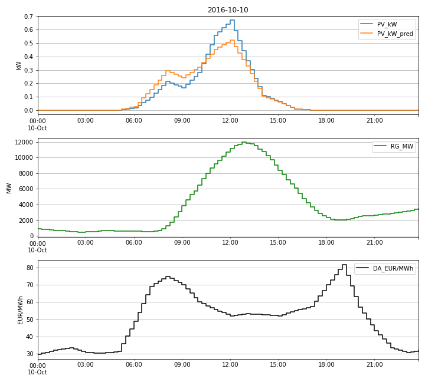
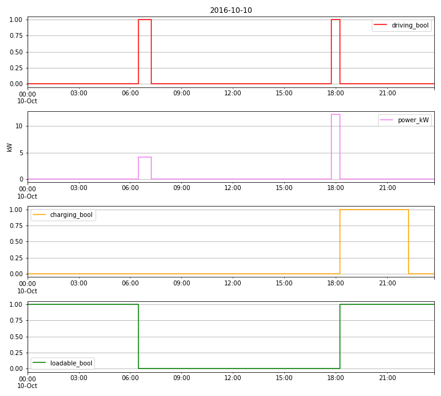
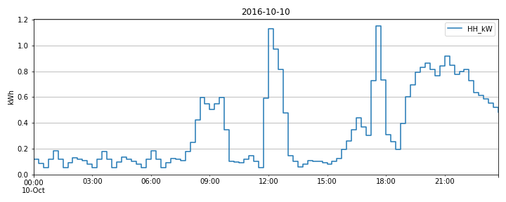

# DSM-Data

This repository enables users to process some publicly available Demand Side Management (DSM) data. The latter are loaded as raw data, in some cases patched, sliced, resampled, and matched to yield quarter-hourly sampled time series for the year 2016 of 

- renewable generation (RG) in Germany
- day-ahead prices (DA) in Germany-Austria-Luxemburg
- photovolatic production (PV) in a localized place in Germany
- electric vehicle (EV) usage from UK
- household demand (HH) from Ireland

## Special Issue in Energies

The generated data is used, among others, by authors of the Special Issue ["Demand Side Management of Distributed and Uncertain Flexibilities"](https://www.mdpi.com/journal/energies/special_issues/demand_side_management_distributed_uncertain_flexibilities) in the Journal [Energies](https://www.mdpi.com/journal/energies). Researchers are welcome to contribute! The deadline for manuscript submissions is 30 June 2021.

The Special Issue will deal with novel contributions that investigate the optimization and control of distributed and uncertain flexibilities. In order to maintain the integrity, transparency and reproducibility of contributions, authors will

- use a common set of publicly available real data including household demand, PV production, EV utilization, total renewable energy generation, and day-ahead prices (i. e. this repository)
- release their computer code either by deposition in a recognized, public repository or upload as supplementary information to the publication.

Topics of interest for publication include, but are not limited to:

- Distributed Demand Side Management
- Incentive Based Demand Response
- Uni- and Bidirectional Communication Infrastructures
- Real Time Pricing
- Bilevel optimization
- Power Matching
- Model Predictive Control
- Cost Minimization
- Welfare Maximization
- Peak Shaving
- Minimization of Customer Discomfort
- Grid Security Maximization
- Maximization of Renewable Energy Integration
- Power Loss Minimization

Visit the Special Issue's website for further details.

## Folder Structure

- code
- data/rg/raw
- data/rg/processed
- data/da/raw
- data/da/processed
- ...
- data/aggregate/processed
- figures

The data in the raw folders has to be filled by the users themselves by downloading the raw data from websites that are specified in the code files. The toc.txt files in the raw folders give the target structure and file names after filling the raw folders.

## Generation of Processed Data

By executing the the [Jupyter Notebooks](https://jupyter.org/)

1. Data_RG.ipynb
2. Data_DA.ipynb
3. Data_PV.ipynb
4. Data_EV.ipynb
5. Data_HH.ipynb
6. Aggregation.ipynb

pickle- or csv-files of processed data is generated in the processed subfolders.

## Data Sources

- RG: [open-power-system-data.org](https://data.open-power-system-data.org/time_series/)
- DA: [transparency.entsoe.eu](https://transparency.entsoe.eu/transmission-domain/r2/dayAheadPrices/show). A free registration is needed before data can be downloaded.
- PV: [PVGIS](https://re.jrc.ec.europa.eu/pvg_tools/en/tools.html)
- EV: [My Electric Avenue](http://myelectricavenue.info/)
- HH: [ISSDA](https://www.ucd.ie/issda/data/commissionforenergyregulationcer/). A data request form for research purposes has to be signed and sent to ISSDA by email before data can be downloaded.

Details are given in the code files.

## Maximum EV and HH Data Sizes

- EV: 215 participants, 100 when filtering out social trial participants
- HH: 4225 residentials

## Sampling and Units

Raw data is resampled to a common sampling interval of 1/4 hour. The processed data has the following units:

|                | raw sampling | raw unit | processed sampling | processed unit |
|----------------|--------------|----------|--------------------|----------------|
| HH demand      | 1/2 hour     | kWh      | 1/4 hour           | kW             |
| EV consumption | seconds      | kW       | 1/4 hour           | kW             |
| EV driving     | seconds      | boolean  | 1/4 hour           | boolean        |
| EV charging    | seconds      | boolean  | 1/4 hour           | boolean        |
| EV loadable    | -            | -        | 1/4 hour           | boolean        |
| PV production  | 1 hour       | kW       | 1/4 hour           | kW             |
| DA price       | 1 Hour       | EUR/MWh  | 1/4 hour           | EUR/MWh        |
| RG production  | 1/4 hour     | MW       | 1/4 hour           | MW             |

The EV loadable state is defined as

- True for non-driving time frames that include at least one charging period.
- True for the non-driving periods between 00:00 and 06:00 which are expanded into the future and the past up to the adjacent driving periods.
- False otherwise.

## Uncertainty and Predictions

Predictions are generally not provided for the time series. In principle, the uncertainty is given by assuming one time window of the data as known and the subsequent data as unknown. It is then up to the authors to decide how to deal with this uncertainty.

For the PV data a simple one day-ahead prediction is computed as a weighted sum: p=0.75 is the weight of the values of the prediction day, and 1 - p is the weight of the values of the day before. (Only the first day of the time series is handled differently, see the code.) If required, this method can be applied by users to the RG and HH time series. Note that predictions of EV data can not be generated by this method.

## Examples

## Alert

Data was not checked completely for consistency! See this as part of the data uncertainty. :-)

## Feedback

Please contact us, when you find errors or have ideas for improvements.

## Contact

Dr. Klaus Rheinberger, [Research Center Energy](https://www.fhv.at/en/research/energy/)
[FH Vorarlberg University of Applied Sciences](https://www.fhv.at/), [klaus.rheinberger@fhv.at](mailto:klaus.rheinberger@fhv.at)
